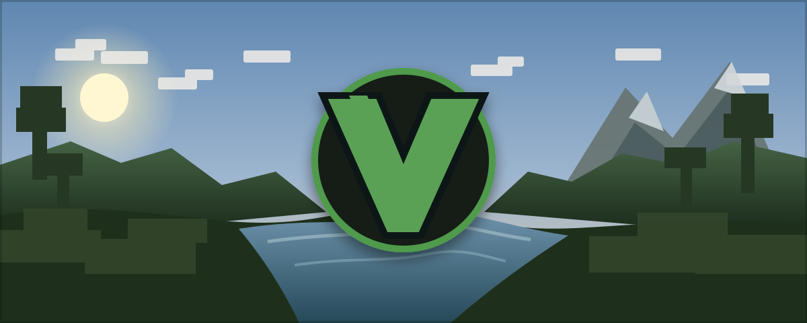

<div align="center">



# VoxyQuest

**Minecraft, your way — in VR or on a flat screen.**

VoxyQuest is a launcher project focused on making Minecraft easier to run across both **VR** and **Flat Screen** gameplay, with an emphasis on performance, stability, mod support, and flexible instance settings.

</div>

---

## What VoxyQuest is aiming for

VoxyQuest is being built around a simple goal: keep launching and configuring Minecraft straightforward while supporting different ways to play.

The project is focused on:

- **VR gameplay** with better stability and smoother performance.
- **Flat Screen Mode** for playing without a headset.
- **Keyboard & mouse support** for Flat Screen Mode.
- **Mod support** without turning setup into a mess.
- **Instance settings** so different setups can stay organized.
- **Forge support** and broader mod-loader compatibility over time.
- **Ongoing optimization** to reduce overhead and improve the experience.

## Development status

VoxyQuest is still in active development. Performance optimization and VR stability are the current priorities, while Flat Screen Mode, input support, mod support, instance settings, Forge, and additional mod loaders are planned.

## 🗺️ VoxyQuest Roadmap

### 🚧 In Progress

- Performance optimization
- Better VR stability

### 📋 Planned

- Flat Screen Mode
- Keyboard & mouse support for Flat Screen Mode
- Mod support
- Instance settings
- Forge support
- More mod loader support
- More optimization

### ✅ Goal

Make VoxyQuest smoother, easier to use, and support both VR and Flat Screen gameplay with better mod support.

The standalone roadmap is also available in [`docs/ROADMAP.md`](docs/ROADMAP.md).

## Repository layout

```text
.
├── .github/
│   ├── ISSUE_TEMPLATE/
│   └── PULL_REQUEST_TEMPLATE.md
├── assets/
│   └── voxyquest-banner.svg
├── docs/
│   ├── ARCHITECTURE.md
│   └── ROADMAP.md
├── CONTRIBUTING.md
├── SECURITY.md
└── README.md
```

## Contributing

Bug reports, feature ideas, compatibility reports, optimization work, and launcher improvements are welcome. See [`CONTRIBUTING.md`](CONTRIBUTING.md) before opening a pull request.

For security-sensitive reports, follow [`SECURITY.md`](SECURITY.md) instead of posting details publicly.

---

<div align="center">

**VoxyQuest** — VR and Flat Screen Minecraft from one launcher.

</div>
